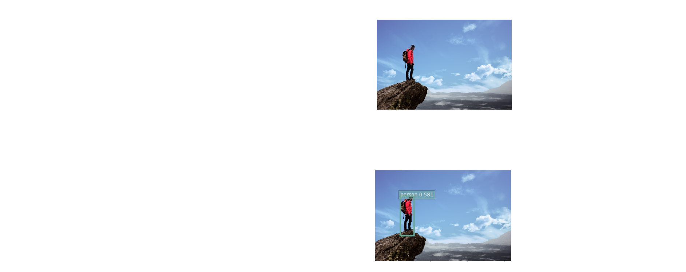
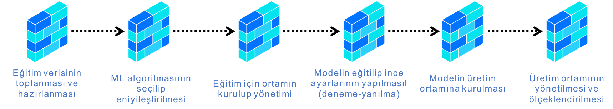
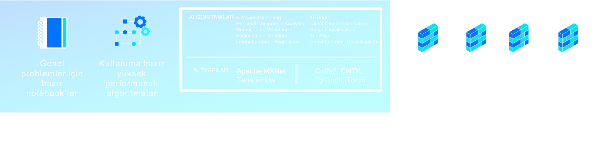
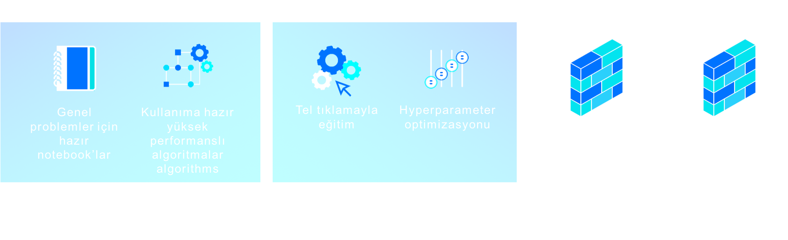
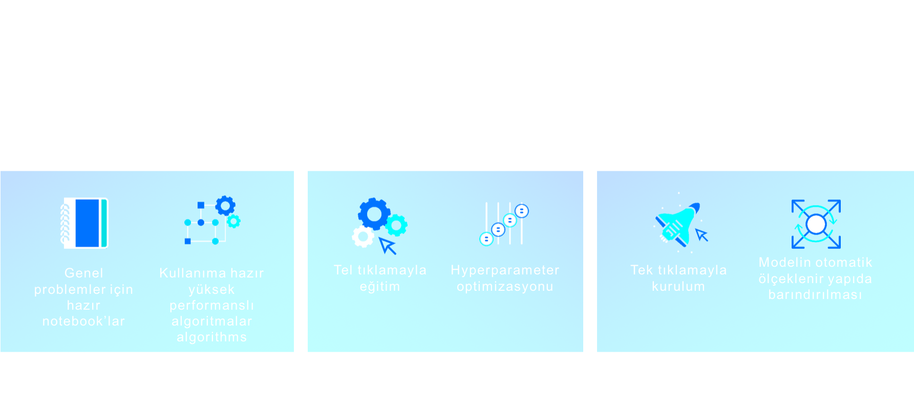

# Amazon Sagemaker Kullanarak Özelleştirilmiş Nesne Tespit Modeli Oluşturma

Nesne tespiti, verilen bir imajdaki nesneleri imajda bulundukları koordinatlarlarla beraber tanımlamaktır. Klasik bir nesne tespit çözümü girdi olarak imaj alır, çıktı olarak tespit ettiği nesneleri içinde bulundukları kutuların koordinatlarıyla(bounding box) beraber verir. 

Bu atölyede, görüntülerdeki kuşların türlerini ve görüntüdeki yerini tespit için Amazon Sagemaker ve Caltech Birds açık veri setini kullanacağız. 

Veri bilimi yaşam döngüsünün veriyi uygun formatlara dönüştürülmesinden, oluşturulan modelin sunulmasına kadar birçok aşamasını göreceğiz:

Amazon SageMaker, geliştiricilere ve veri bilimcilere Machine Learning(ML) modellerini hızla geliştirme, eğitme ve dağıtma kabiliyeti sunan bir servis. Bu servisi kullanarak yapabileceklerinizden bazıları:

+ Verilerinizi etiketleme, hazırlama, algoritma seçme:

+ Modeli eğitme, optimize etme:

+ Tahmin yapma ve dağıtma(üretim, dev-test vb. ortamlar): 

Çözümü geliştirebilmek için öncelikle eğitim veri setini indirip işleyeceğiz, algoritmanın veri seti üzerinde çalışabilmesi için bir eğitim görevi yaratıp konfigüre edeceğiz ve algoritmanın oluşturduğu modeli barındırmak için bir endpoint oluşturacağız. Böylece Amazon Sagemaker nesne tespit algoritmasının nasıl çalıştığını inceleyebileceğimiz uçtan uca bir çalışma yapmış olacağız. [Caltech birds açık veri setini](http://www.vision.caltech.edu/visipedia/CUB-200-2011.html) ve Single Shot multibox Detector ([SSD](https://arxiv.org/abs/1512.02325)) algoritmasını Amazon Sagemaker platformu üzerinde kullanacağız.

### Ön koşullar
AWS tarafından koordine edilen bir atölye çalışmasındaysanız size gerekli bilgiler iletilecektir.
Değilseniz, bir AWS hesabınız olmalıdır. Yoksa şu linkten oluşturabilirsiniz: https://aws.amazon.com/resources/create-account/

### Adımlar

Atölye çalışması esnasında aşağıdaki adımları tamamlayacağız:

1. <a href="module1/">**Modül 1**</a> - Amazon Sagemaker kullanarak notebook makinasının ayağa kaldırılması
2. <a href="module2/">**Modül 2**</a> - Amazon S3 üzerinde bucket'ımızın oluşturulması
3. <a href="module3/">**Modül 3**</a> - Modelin oluşturulması ve barındırılması

