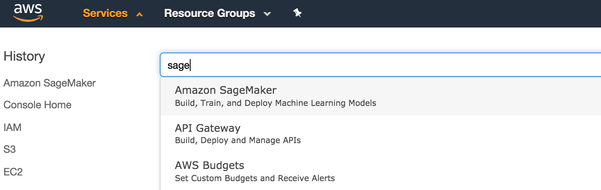
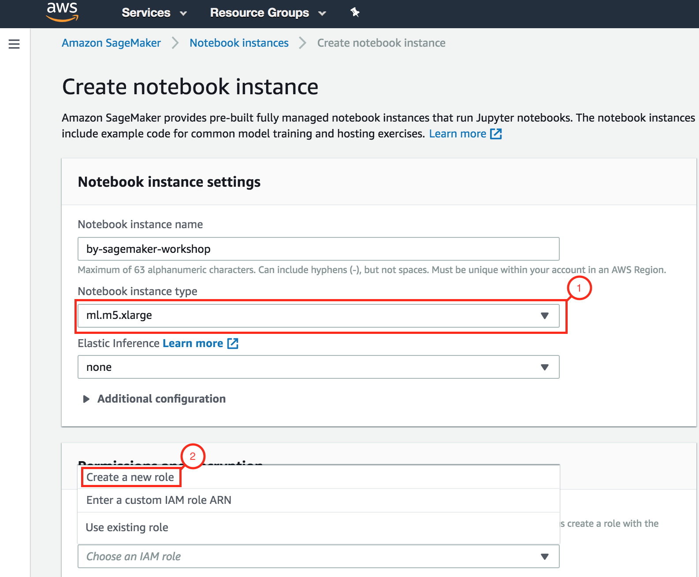
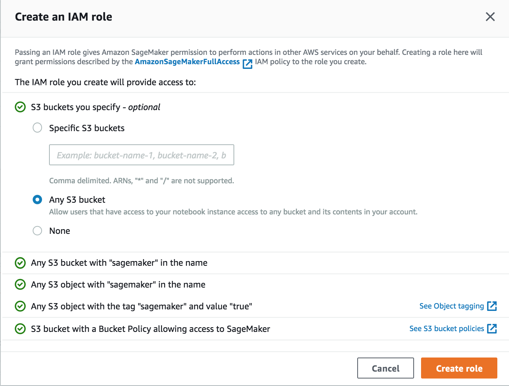
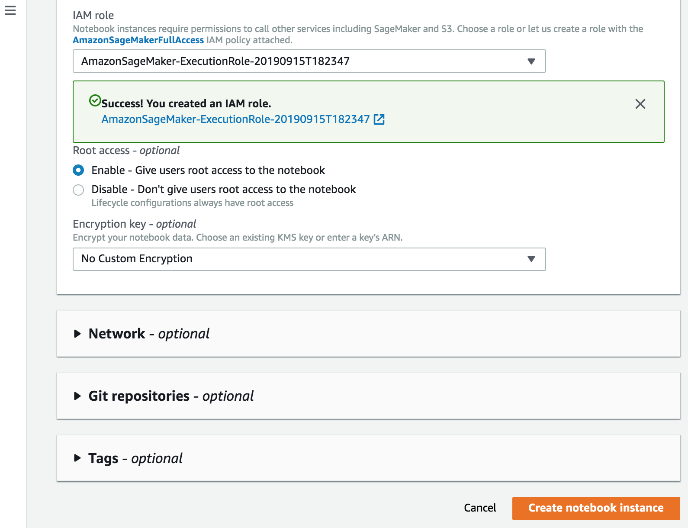
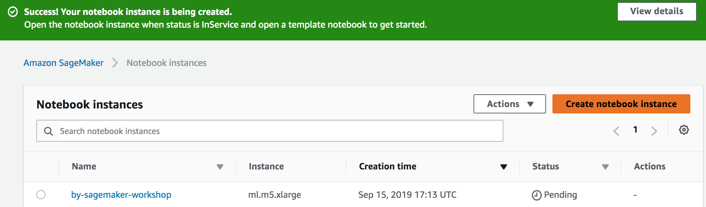

## 1. Amazon Sagemaker notebook makinasının ayağa kaldırılması
+ AWS Konsol'a login olun
+ AWS Services etiketinin aldındaki arama kutusuna Sagemaker yazın, çıkan linke tıklayın

+ Konsolda sağ üst köşedeki Region'lardan Ireland'in seçili olduğundan emin olun ve "Create notebook instance" butonuna tıklayın

+ Notebook instance name kutucuğuna istediğiniz tanımlayıcı metni girin(<adınız ve soyadınızın ilk harfleri>-sagemaker-workshop olabilir). Notebook instance type olarak ml.m5.xlarge seçin. "IAM role" combo box'ında Create a new role'ü seçin

+ Açılan ekranda Any S3 bucket radio button'ını işaretleyin ve "Create role" butonuna tıklayın.

+ Diğer alanları değiştirmeden Create Notebook Instance butonuna tıklayın

+ Notebook Instances ekranında yarattığınız notebook makinasının Status'u Pending'ten InService'e dönüştüğü esnada <a href="module2/">**Modül 2**</a>'yi tamamlayabilirsiniz

