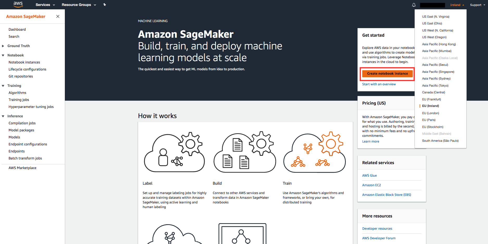
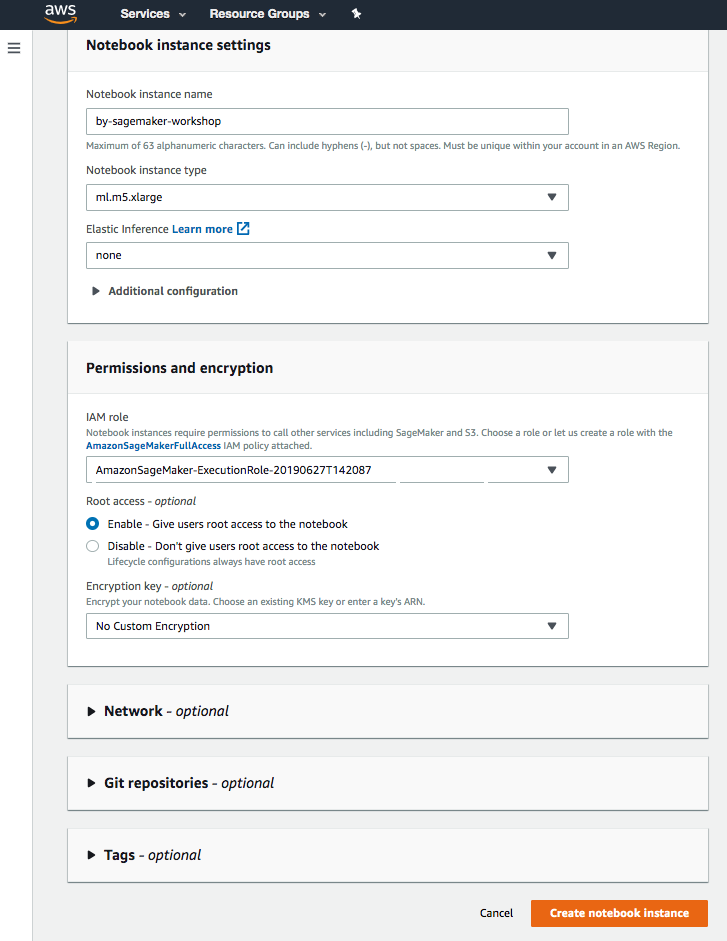
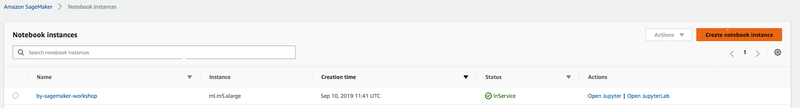

## 1. Amazon Sagemaker notebook makinasının ayağa kaldırılması
+ AWS Konsol'a login olun
+ AWS Services etiketinin aldındaki arama kutusuna Sagemaker yazın, çıkan linke tıklayın
+ Konsolda sağ üst köşedeki Region'lardan kendinize yakın olan birini seçin (sadece Amazon Sagemaker’ın kullanılabildiği Regionlar listelenmektedir). Seçtiğiniz Region’ın adını bir kenara not alın

+ Notebook instance name kutucuğuna istediğiniz tanımlayıcı metni girin. Notebook instance type olarak ml.m5.xlarge seçin. Diğer alanları değiştirmeden Create Notebook Instance butonuna tıklayın

+ “Create notebook instance” butonuna tıklayın

+ Notebook Instances ekranında yarattığınız notebook makinasının Status'u Pending'ten InService olana kadar bekleyin.

+ Makinanın Status'u InService olduğunda Actions sütununun altındaki Open JupyterLab linkine tıklayın

+ Linke tıkladığınızda JupyterLab Notebook ortamı karşınıza çıkacaktır. Bir sonraki modüle devam edebilirsiniz.

