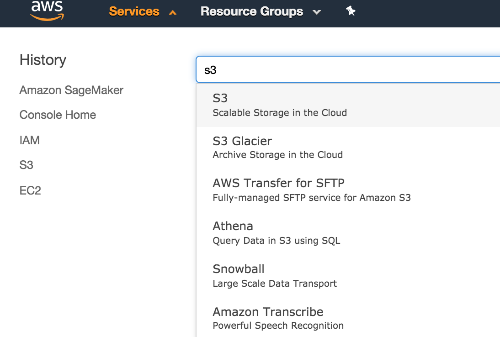
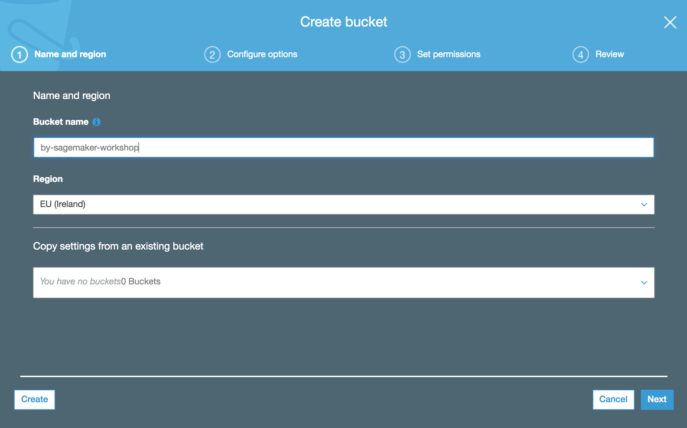

## 2. Amazon S3 üzerinde bucket'ımızın oluşturulması
+ Üzerinde makina öğrenmesi algoritmalarını deneyeceğimiz ortamımız oluşturulurken, bu ortamın ihtiyaç duyacağı veriyi tutacağımız S3 bucket’ımızı oluşturalım. Konsolda sol üst köşedeki Services butonuna tıklayın, çıkan kutucuğa S3 yazın ve en üstte gelen linke tıklayın.

+ Gelen ekranda Create Bucket butonuna tıklayın

+ Bucket name alanına içinde sagemaker kelimesi geçecek şekilde bir metin girin. Örn. <adınız ve soyadınızın ilk harfleri>-sagemaker-workshop. Bucket adını not alın. Eğer hata alırsanız daha farklı bir isim girmeyi deneyin. Oluşturulan bucket adları global olarak eşsiz olmalıdır.
+ Region olarak EU (Ireland) seçin. Oluşturduğunuz bucket bir önceki modülde oluşturduğunuz notebook makinası ile aynı AWS Region'ında olmalıdır. AWS Region'ları hakkında daha detaylı bilgiye [şu linkten](https://docs.aws.amazon.com/AmazonRDS/latest/UserGuide/Concepts.RegionsAndAvailabilityZones.html) ulaşabilirsiniz.
+ Sol alt köşedeki "Create" butonuna tıklayın

+ Bucket'ınızın başarıyla oluşturulduğunu gördüyseniz <a href="../module3/">**Modül 3**</a>'e devam edebilirsiniz.
+ Notebook Instances ekranında yarattığınız notebook makinasının Status'u Pending'ten InService'e dönüştüğü esnada <a href="../module2/">**Modül 2**</a>'yi tamamlayabilirsiniz

