## 3. Modelin oluşturulması
+ Konsolda sol üst köşedeki Services butonuna tıklayın, çıkan kutucuğa Sagemaker yazın ve Amazon Sagemaker linkine tıklayın

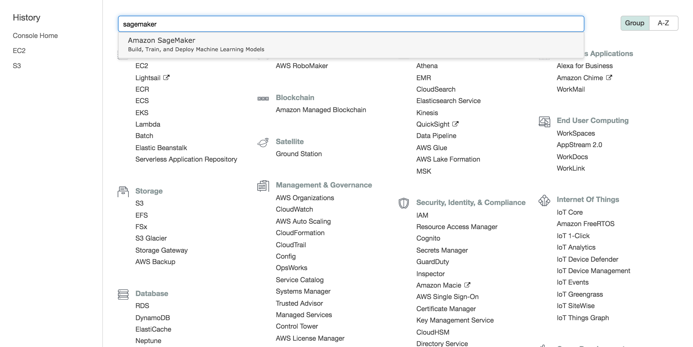

+ Soldaki menüden Notebook instances linkine tıklayın

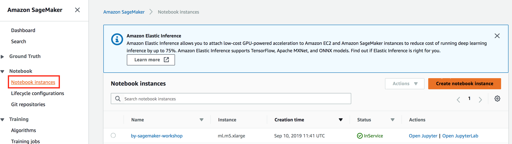

+ Gelen listede oluşturduğunuz Notebook Instance’ın Status’u InService olarak görünüyorsa "Open Jupyter Lab" linkine tıklayın. InService olarak 
görünmüyorsa birkaç dakika daha bekleyin

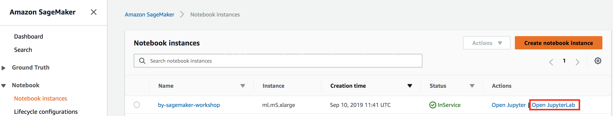

+ "Open Jupyter Lab" linkine tıkladığınızda tarayıcınızın yeni bir tabında Jupyter Lab ekranı açılacak
+ Açılan ekranın sol tarafındaki "Git Clone" butonuna tıklayın

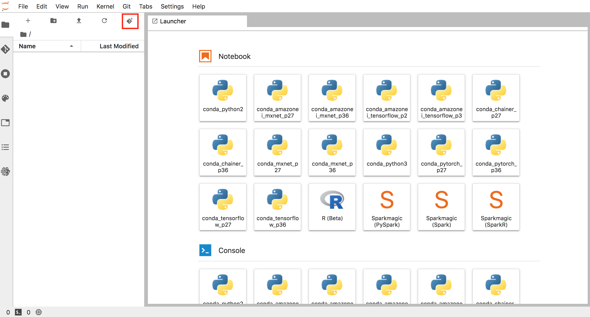

+ Çıkan pop-up'a https://github.com/barisyasin/sagemaker-workshop-tr.git adresini girin ve Clone butonuna tıklayın.

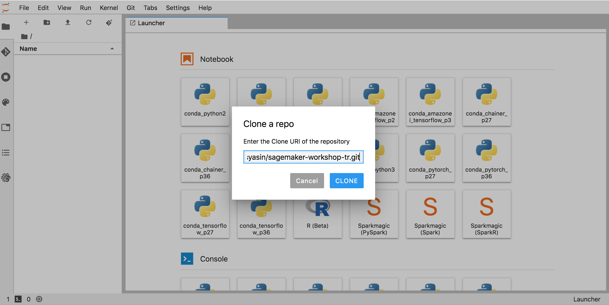

+ Bir kaç saniye bekledikten sonra sol taraftaki File Browser tabında repository klasörünün geldiğini göreceksiniz. Eğer gelmezse yine aynı tabdaki Refresh File List butonuna tıklayın.

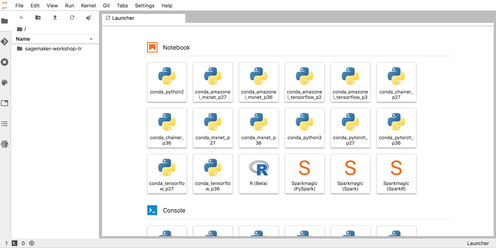

+ sagemaker-workshop-tr/code/object_detection_birds.ipynb python notebook dosyasının üzerine çift tıklayarak açın

+ Notebook dosyasını genel olarak gözden geçirin

+ Notebook içinde <your_s3_bucket_name_here> yazan yere not aldığınız bucket adını kopyalayın.

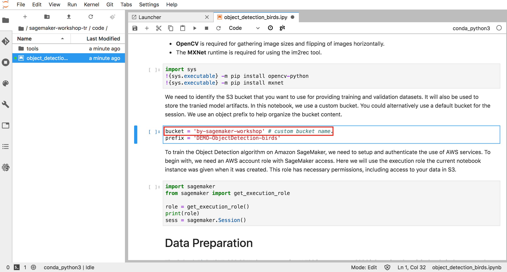

+ En üstteki menüden Run-->Run All Cells'i seçin ve notebook'unuzda bulunan bütün satırların işletilmesinin tamamnlanmasını bekleyin. Tamamlanan satırların sol üst köşesinden o satırın işletilme sırasını gösteren bir sayı bulunur. İşletilmekte olan veya henüz işletilmemiş hücrelerin sol üst köşesinde ise [*] sembolü bulunur.

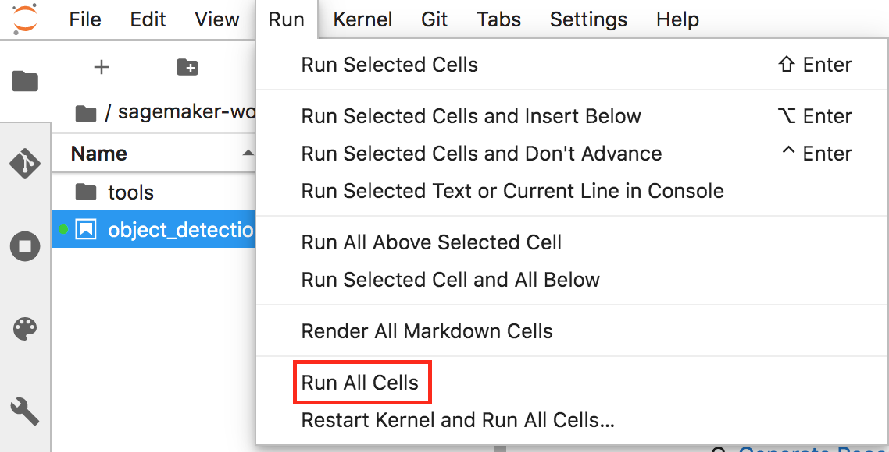

+ Training aşaması biraz zaman alacaktır. Bu esnada Amazon Sagemaker ortamını daha iyi tanımak için şu adımları yerine getirebilirsiniz: 
    + Notebook'u satır satır okuyarak hücrelerin çıktıları inceleyebilirsiniz.
    + od_model.fit(inputs=data_channels, logs=True) hücresinin altına yazılan logları takip edebilirsiniz. Sözkonusu satır modelimizin trainingini yapan ve en uzun sürmesi beklenen satırdır.
    + Sagemaker konsolundan notebook makinası tarafından başlatılan Training job'ları gözlemleyebilirsiniz.

    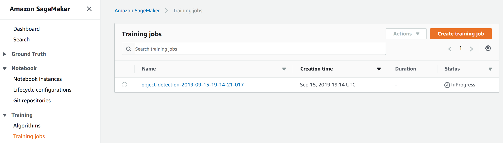
    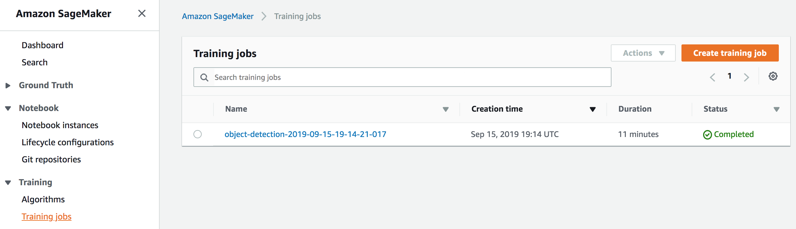
    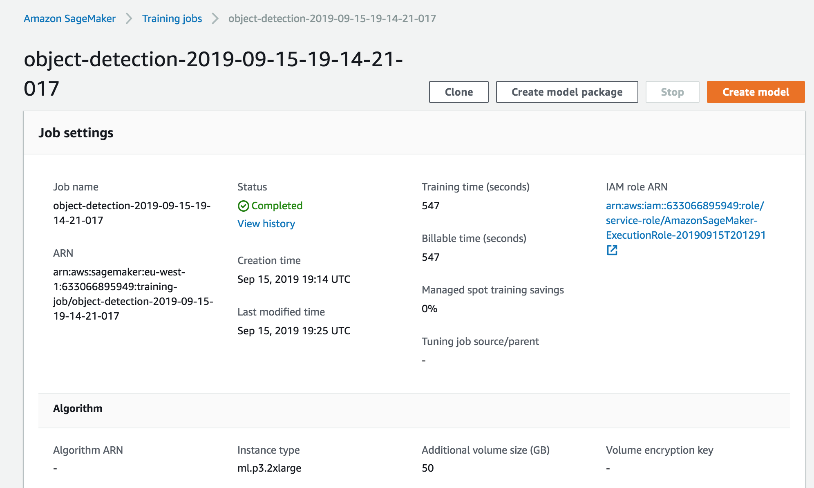
    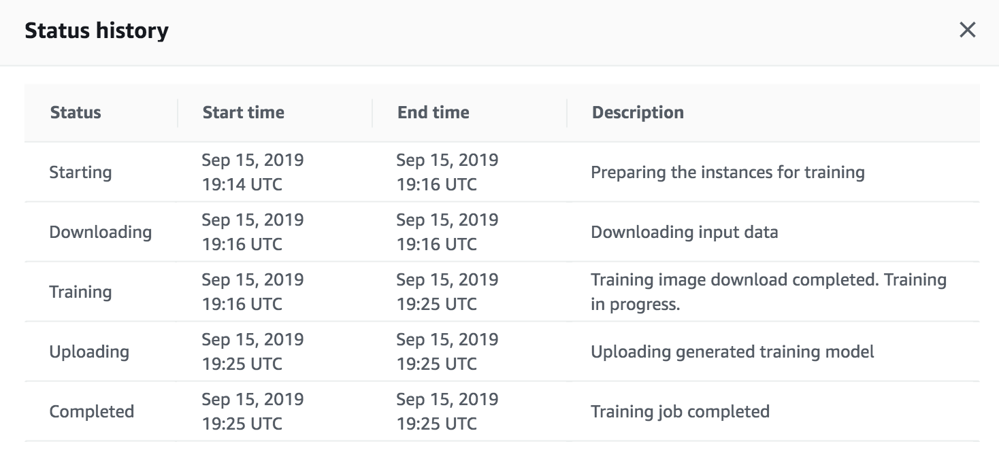

    + Sagemaker konsolundan notebook makinası tarafından oluşturulan Endpoint'leri inceleyebilirsiniz
+ Training tamamlandığında modeli genişletilmiş veri setiyle tekrar eğitilmeden önceki haliyle karşılaştırın.
    + Önceki mAP:

    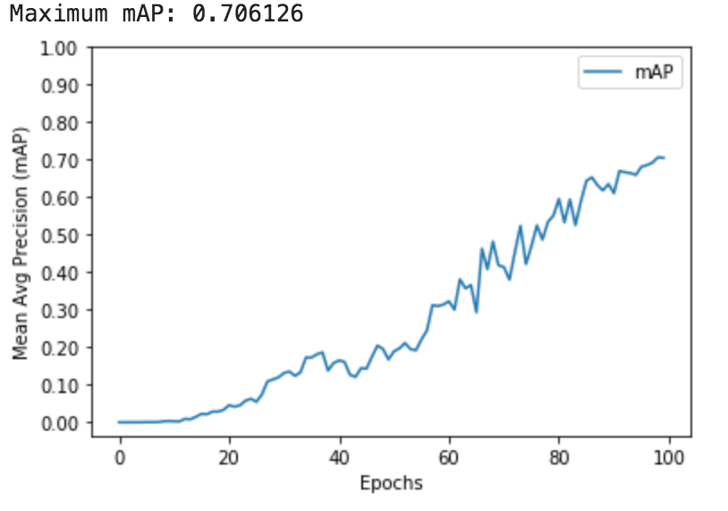

    + Sonraki mAP:

    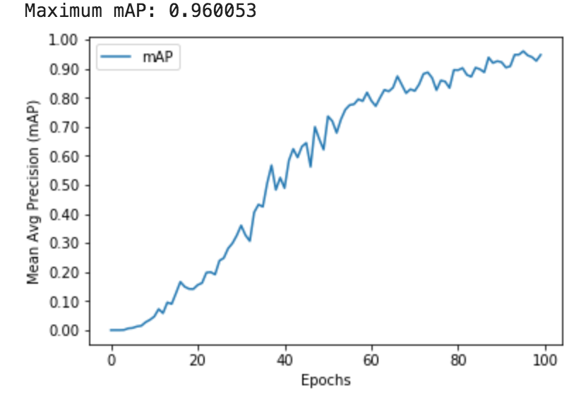

    + Önceki tahmin 1-2:

    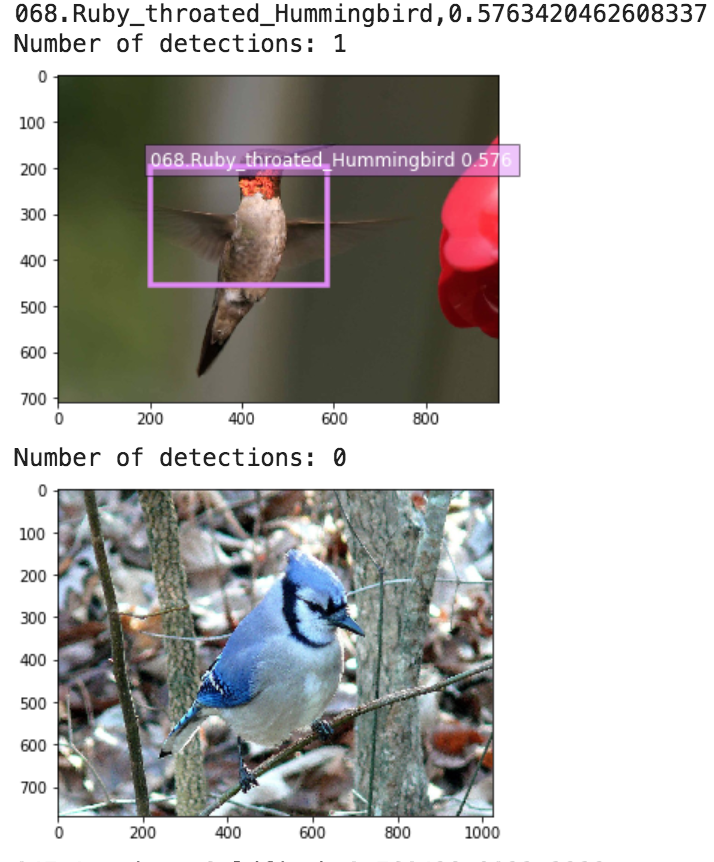

    + Sonraki tahmin 1-2:

    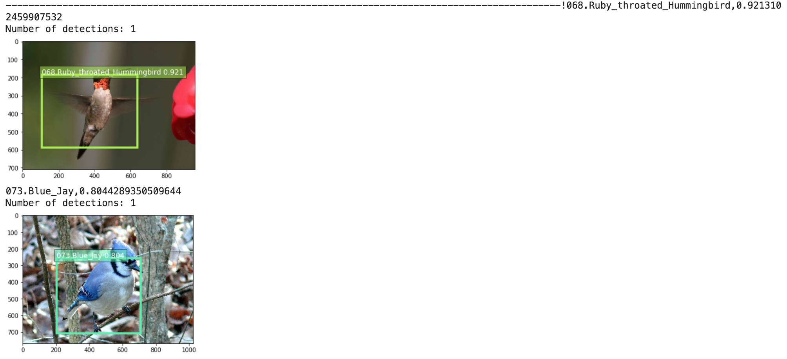

    + Önceki tahmin 3-4:

    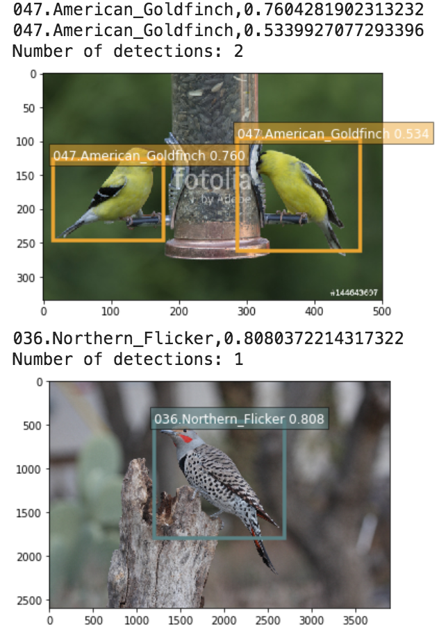

    + Sonraki tahmin 3-4:

    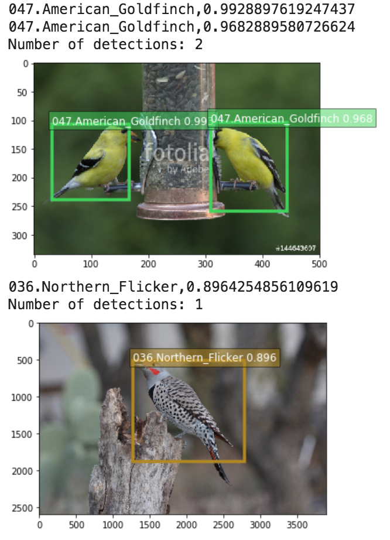

    + Önceki tahmin 5:

    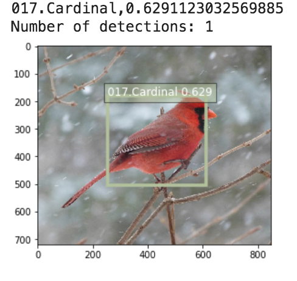

    + Sonraki tahmin 5:

    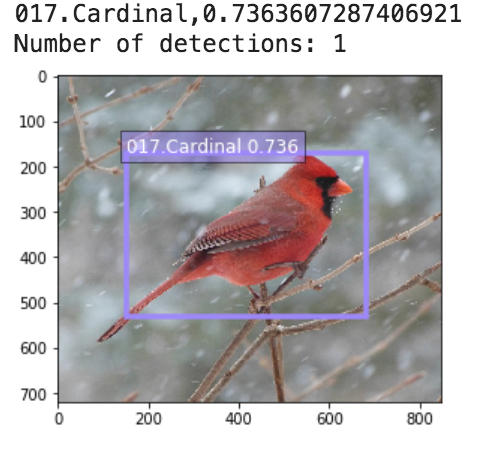
   
    